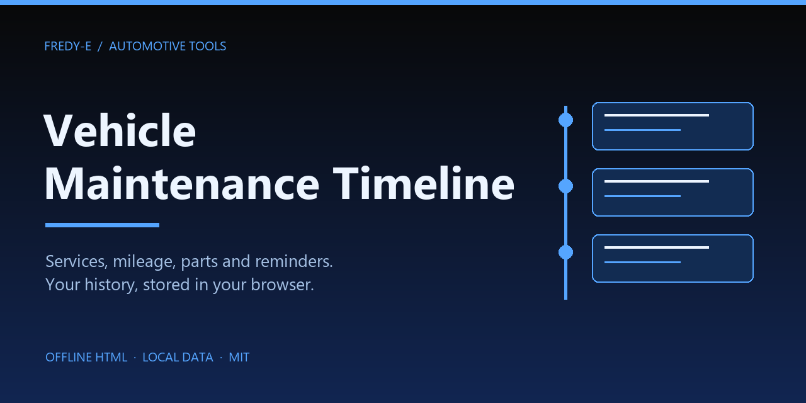
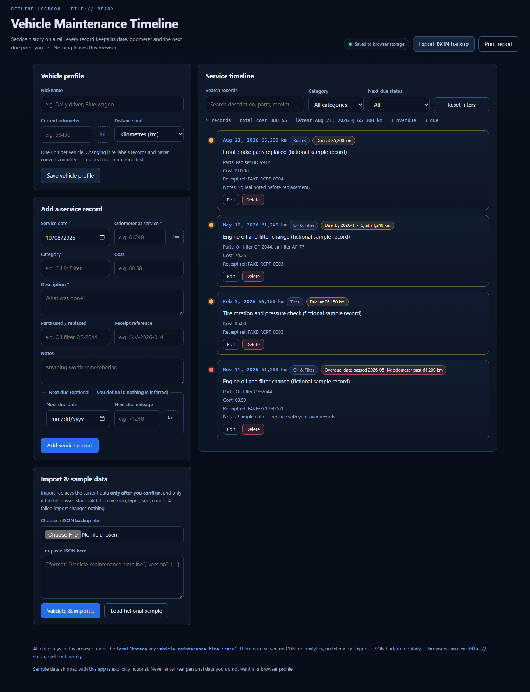

# Vehicle Maintenance Timeline



Development and CI: [verification instructions](docs/verification.md).

An offline, single-file-friendly vehicle service logbook. `index.html` opens **directly from disk** (`file://`): no server, no build step, no CDN, no data/API calls, no telemetry, no accounts. Records are stored locally in the browser; JSON export is the backup mechanism. If hosted, the browser downloads the app files from the host, but imported records are not uploaded.

```
Vehicle-Maintenance-Timeline/
├── index.html      # the app (open this)
├── style.css       # dark-blue engineering theme, timeline motif, print styles
├── core.js         # pure logic: validation, scheduling, filtering, import/export, storage adapter
├── app.js          # UI wiring (DOM, dialogs, toasts, print report, test hook)
├── README.md
├── LICENSE         # MIT
├── package.json    # private package: npm scripts + pinned Playwright dev dependency, no runtime deps
├── package-lock.json    # locked dev install replayed by CI (`npm ci`)
├── .gitignore
├── .github/
│   └── workflows/verify.yml   # CI: npm ci → unit → browser → layout
├── assets/
│   └── banner.png             # decorative project card
├── docs/
│   ├── verification.md        # development & CI instructions
│   ├── images/app.png         # README screenshot (fictional sample)
│   └── releases/v0.1.0.md     # release notes
└── tests/
    ├── core.test.cjs           # 77 unit tests, zero dependencies (node:test)
    ├── browser.cjs             # real-browser file:// smoke suite (Playwright, dev-only)
    ├── layout.browser.test.cjs # real-browser layout/geometry regression suite (Playwright, dev-only)
    └── evidence/
        ├── red-run.txt         # recorded RED phase (tests written before implementation)
        ├── green-run.txt       # recorded GREEN phase (all passing)
        ├── browser-smoke.md    # real-Chrome file:// workflow transcript + bug found/fixed
        └── layout-fix.md       # desktop-overlap / mobile-overflow fix transcript (RED → GREEN)
```

## Screenshot



## Quick start

- **Use it:** double-click `index.html` (or open it with a browser). Everything works from `file://`.
- **Test it:** `npm test` (or `node --test tests/core.test.cjs`) runs the unit suite with zero packages — Node.js 22+ (`package.json` `engines`; developed on Node v26.7.0). `npm ci` installs the dev-only Playwright dependency used by the browser suites.
- **Browser suites (development/CI only):** `npm run test:browser` (file:// workflow smoke) and `npm run test:layout` (desktop/mobile geometry + print regression). Both drive the real app in headless Chrome, falling back to bundled Chromium. The app itself has zero runtime dependencies.
- **Packaging:** the package is `private` (publishing is handled elsewhere), `LICENSE` is the MIT license, and `package-lock.json` locks the dev install that CI replays with `npm ci`.

## Features

- **Vehicle profile**: friendly nickname, current odometer, one distance unit per vehicle (`km` or `mi`).
- **Service records**: real calendar date, non-negative whole-number mileage, category, description, parts, cost (2-decimal), receipt reference, notes — plus an optional user-defined **next due date** and **next due mileage**.
- **Search & filters**: free-text search across description/category/parts/receipt/notes/date/mileage; exact category filter; next-due status filter (overdue / due / unknown).
- **Edit & delete** with explicit confirmation dialogs (delete is never one click).
- **Versioned JSON** persisted to `localStorage` when available; visibly switches to **in-memory** when storage is blocked, full, or lying — it never claims "saved" unless the write was verified by read-back.
- **JSON export**: real file download (`maintenance-timeline-backup-YYYY-MM-DD.json`) — the important backup path for `file://` origins.
- **JSON import**: strict schema/version/type/size/count validation; atomic — on any validation failure the existing data is untouched.
- **Printable report**: a text-only report built into `#print-root` (all user strings via `textContent`), rebuilt on `beforeprint` — so the Print button and the browser's own Ctrl+P/print flow both print the current data.
- **Fictional sample data** (4 records) that can only replace existing records after an explicit confirmation.
- **Responsive, accessible**: keyboard-operable, visible focus, labels on every field, `aria-live` regions, native `<dialog>` confirmations, `Esc` closes dialogs, `/` focuses search.

## Data model (schema version 1)

```json
{
  "format": "vehicle-maintenance-timeline",
  "version": 1,
  "updatedAt": "2026-10-08T00:00:00.000Z",
  "vehicle": { "nickname": "…", "odometer": 68450, "unit": "km" },
  "entries": [
    {
      "id": "e-abc123",
      "date": "2026-05-10",
      "mileage": 61240,
      "category": "Oil & Filter",
      "description": "Engine oil and filter change",
      "parts": "Oil filter OF-2044",
      "cost": 74.25,
      "receipt": "INV-2026-014",
      "notes": "",
      "nextDate": "2026-11-10",
      "nextMileage": 71240,
      "createdAt": "2026-05-10T09:00:00.000Z"
    }
  ]
}
```

| Field | Rules |
|---|---|
| `date`, `nextDate` | strict `YYYY-MM-DD`, must be a **real calendar date** (leap years honoured, Feb 30 / Apr 31 / month 13 rejected), years 1900–2100 |
| `mileage`, `nextMileage`, `odometer` | whole number `0 … 10,000,000`; empty next-due fields mean "not set" (null) |
| `cost` | number `0 … 10,000,000`, rounded to 2 decimals; null allowed |
| `nickname` | ≤ 60 chars | `category` ≤ 40 (defaults to `"General"`) | `description` ≤ 2000 (required) |
| `parts` ≤ 500 | `receipt` ≤ 200 | `notes` ≤ 4000 |
| `id` | `[A-Za-z0-9][A-Za-z0-9_-]{0,63}`, unique per state; generated client-side if absent |
| **strictness** | unknown fields are **rejected** at state and entry level; strings are trimmed and control characters stripped; a UTF-8 BOM is tolerated |
| **bounds** | ≤ 5,000 entries; imported documents ≤ 2 MiB; validation errors are capped (50 + a sentinel) |

## Scheduling semantics (no inferred intervals — ever)

Every due point is defined by the user on a record. Statuses are exactly `overdue`, `due`, `unknown`:

- **date criterion**: `today > nextDate` → `overdue`; `today <= nextDate` → `due` (a point is "due" on the day itself).
- **mileage criterion**: `odometer > nextMileage` → `overdue`; `odometer <= nextMileage` → `due`; if the vehicle odometer is unknown → `unknown` for that side.
- **overall**: any `overdue` → `overdue`; else any `due` → `due`; else `unknown` (i.e. no criteria set, or mileage-only with unknown odometer).

No "due soon" window, no default service intervals, no manufacturer schedules. The app only mirrors what the user typed.

## Unit policy (km/mi)

- The state holds **one unit per vehicle** (`"km"` or `"mi"`, case-sensitive). Entries store plain numbers in that unit.
- **No conversion**, ever, and no mixing: entries have no unit field of their own, so mixed units cannot be represented.
- Changing the unit on a vehicle that has records requires `confirmUnitChange` at the core level and an explicit dialog in the UI; existing numbers are re-labelled, not converted.

## Storage behavior (honest, never falsely "saved")

The core storage adapter (`Maintenance.createStore`) probes storage on startup, verifies every write by reading it back, and reports one of:

| mode | reason | Meaning / UI |
|---|---|---|
| `storage` | — | Saved to browser storage (verified by read-back) |
| `memory` | `no-storage` | No storage object available |
| `memory` | `storage-unavailable` | Storage blocked (e.g. `SecurityError` on `file://` or private mode) |
| `memory` | `quota` | `QuotaExceededError` — storage full |
| `memory` | `verify-failed` | Storage silently dropped the write |
| `memory` | `storage-error` | Other storage error |
| `memory` | `serialize-failed` | State could not be serialized |

- `store.save()` returns `{ saved: boolean, mode, reason, bytes }` — **`saved: true` is only returned after a verified read-back**. Toasts and the `#storage-status` chip repeat exactly this truth ("saved to browser storage" vs "held in memory only (…reason…)").
- Mode switches are pushed to listeners (`store.onChange`) so the chip updates immediately; recovery is automatic if storage starts working again on a later save.
- If stored data exists but **fails validation on load**, the app does not overwrite it: a banner offers "Download raw stored data" and "Start fresh (discard)" (confirmed), and persistence stays blocked until the user decides.

### `file://` notes

Browsers treat `file://` storage inconsistently. Chromium-family browsers and Firefox generally allow and persist `localStorage` for `file://` pages; some configurations block it. When blocked, the app visibly flips to in-memory mode — and the printed/exported JSON remains the way to keep data. Export regularly.

## Import / export

- **Export**: `Export JSON backup` triggers a real download named `maintenance-timeline-backup-<today>.json`. The exact same bytes can be obtained via `MaintenanceApp.exportJSON()` for automated tests.
- **Import**: choose a file or paste JSON, then `Validate & import…`. Validation is strict (format string, `version === 1`, types, sizes, counts, unknown-key rejection). If anything fails, an error list appears and **nothing changes**. If it passes, an explicit confirmation lists how many records will be replaced.
- **Atomicity**: `parseState`/`importState` are pure — they never touch existing state; the UI swaps state only after `{ ok: true }`.
- **Leniency, pinned by tests**: a document that omits `vehicle` imports with `vehicle: null`, and a missing or empty `updatedAt` is stamped with the current time; a *present but unparseable* `updatedAt` still fails validation.
- Round-trip guarantee (unit-tested): `serialize → parse → serialize` is byte-identical, and the parsed value deep-equals the original normalized state.

## Accessibility & keyboard

- Skip link, landmarks, labelled fields, `aria-live` for errors/chip/toast, `role="status"`.
- Confirmation uses native `<dialog>` (`showModal`) → focus is trapped, `Esc` cancels without applying.
- `/` focuses the search box (when not typing in a field); `Tab` order follows the visual flow; `:focus-visible` outlines everywhere.
- Responsive: two-column layout ≥ 960 px, stacked below; filters and fields stack on small screens.

## Automation: DOM selectors & test hook

Every rendered string goes through `textContent`; there is no `innerHTML` with user data anywhere in `app.js`. Cards carry stable hooks:

| Workflow | Drive it like this |
|---|---|
| **Add** | set `#entry-date`, `#entry-mileage`, `#entry-description` (+ optional `#entry-category`, `#entry-parts`, `#entry-cost`, `#entry-receipt`, `#entry-notes`, `#entry-next-date`, `#entry-next-mileage`) → click `#entry-submit` or `form#entry-form.requestSubmit()` |
| **Edit** | click `.entry-card[data-entry-id="<id>"] .entry-edit` → fields populate (submit label becomes "Save changes") → modify → `#entry-submit`; abort via `#entry-cancel` |
| **Delete** | click `.entry-card[data-entry-id="<id>"] .entry-delete` → `#confirm-dialog` opens (`open` attr) → `#confirm-accept` / `#confirm-cancel` |
| **Filter** | dispatch `input` on `#filter-search`; `change` on `#filter-category` / `#filter-status`; `#filter-reset` clears all |
| **Import** | paste into `#import-text` → `#btn-import` → confirm via `#confirm-accept`; or set a file on `#import-file` (loads text into the textarea for review) |
| **Export** | `#btn-export-json` downloads a real file; for string-only checks use `MaintenanceApp.exportJSON()` |
| **Print** | `#btn-print` builds `#print-root` and calls `window.print()`; the browser's own print flow (Ctrl+P / menu Print) rebuilds the same report via the `beforeprint` listener |
| **Sample** | `#btn-load-sample` → confirmation dialog when records exist |
| **Reload persistence** | `location.reload()`; check `#storage-status[data-mode]` and `.entry-card[data-entry-id]` |
| **Storage state** | `#storage-status` attributes: `data-mode="storage|memory"`, `data-reason`, `data-saved="true|false|"`; `#storage-banner` appears for unreadable stored data |

Card anatomy: `.entry-card` (`data-entry-id`, `data-status="overdue|due|unknown"`) → `.entry-date`, `.entry-mileage`, `.entry-category`, `.entry-description`, `.entry-parts`, `.entry-cost`, `.entry-receipt`, `.entry-notes`, `.entry-schedule[data-status]`, `.entry-edit`, `.entry-delete`.

### Test hook: `window.MaintenanceApp`

| Method | Returns | Notes |
|---|---|---|
| `getState()` | deep copy of the normalized state | |
| `entries()` | sorted summary list `{id,date,mileage,category,description,cost,status}` | |
| `getStorage()` | `{mode, reason, reasonText, blocked, lastSave}` | mirrors the honest-save machinery |
| `addEntry(fields)` | `{ok, id?, errors?}` | same code path as the form |
| `updateEntry(id, patch)` | `{ok, errors?}` | |
| `deleteEntry(id)` | `{ok}` | direct (no dialog) — stays honest by reusing `removeEntry` + persist |
| `openDeleteConfirm(id)` | — | opens the real dialog (for dialog-flow tests) |
| `setFilter({query,category,status})` | applied filter | re-renders list |
| `loadSample(force?)` | `true` applied / `false` = dialog opened | `force:true` skips the confirmation |
| `exportJSON()` | JSON string | no download side effect |
| `exportDownload()` | — | triggers the real download |
| `print()` | — | builds report + `window.print()` |
| `parseImport(text)` | `{ok, entries?, errors?}` | validation only, no state change |
| `applyImportText(text)` | `{ok, entries?, errors?}` | applies directly (what a confirmed import does) |
| `requestImport()` | boolean | drives the real UI path incl. dialog |
| `persist()` | `{saved, mode, reason}` | force a save + status render |
| `render()` | `true` | re-render from current state |
| `reset()` | `true` | fresh empty state (test convenience) |
| `selectors` | map of the selectors above | |

## Core API: `window.Maintenance` (and `module.exports`)

Same file, both worlds: `core.js` defines `window.Maintenance` for the page and exports via CommonJS for the tests.

- **Constants**: `FORMAT`, `VERSION`, `UNITS`, `LIMITS`, `MEMORY_REASONS`, `STORAGE_KEY`
- **Scalars**: `isRealDate`, `byteLength`, `escapeHtml`, `formatInt`, `makeId`, `isPlainObject`
- **Validators** (never throw; return `{ok, value}` or `{ok, errors:[{path,message}]}`, value is a fresh normalized copy): `validateVehicle`, `validateEntry`, `validateState`
- **State**: `createState`, `setVehicle` (unit-change guard via `confirmUnitChange`), `addEntry`, `updateEntry` (full re-validation, immutable `id`/`createdAt`), `removeEntry` — all immutable, none touch their input
- **Views**: `sortEntries` (stable: date desc, mileage desc, insertion order kept), `computeSchedule`, `describeSchedule`, `filterEntries`, `summarize`
- **I/O**: `serializeState`, `parseState` (size/type/count/version bounds, BOM-tolerant), `importState` (atomic by construction), `exportFilename`, `buildReportText`
- **Storage**: `createStore({storage, key})` → `{key, load, save, clear, getMode, onChange}`
- **Sample**: `sampleState()` — explicitly fictional ("Sample Sedan (fictional vehicle — not a real car)", `FAKE-RCPT-*` references)

## Testing (tests written first — RED recorded, then GREEN)

The suite (65 tests / 11 suites when first written — since grown to 77 tests / 12 suites; zero dependencies) was written **before** the implementation and covers: impossible dates, numeric constraints, km/mi policy, stable sort, scheduler statuses, filters/summary, import round-trip byte-equality, malformed/oversize/atomicity **at the core validation level**, storage adapter honesty (blocked/quota/lying storage), and safe-output normalization.

Original recorded runs (65-test era):

```console
$ node tests/core.test.cjs
ℹ tests 65
ℹ suites 11
ℹ pass 64   ← first GREEN candidate run: 1 failing test
ℹ fail 1
```

The failing test was a **fixture bug in the test itself** (an expected query match of 2 rows where only 1 row contained the word). Fixing a fixture is not out of bounds; the fix strengthened the fixture (row 3 gained "brake fluid top-up") rather than weakening the assertion. After that:

```console
$ node tests/core.test.cjs
ℹ tests 65
ℹ suites 11
ℹ pass 65
ℹ fail 0
ℹ duration_ms 43.2593
$ echo $?   # 0
```

- Full RED transcript (0/65 pass, stub implementation): `tests/evidence/red-run.txt`
- Full GREEN transcript (65/65 pass): `tests/evidence/green-run.txt`
- Real-browser smoke transcript (Chrome 154 over `file://`, including one CSS bug found and fixed during the pass): `tests/evidence/browser-smoke.md`
- Real-browser layout-fix transcript (desktop column overlap / mobile badge overflow, RED → GREEN): `tests/evidence/layout-fix.md`
- Real-browser suites (Playwright is a pinned **dev** dependency; the app itself has none): `node tests/browser.cjs` opens `file://index.html` and covers workflows, import/export, duplicate-id rejection, print building and blocked storage; `node tests/layout.browser.test.cjs` (also `npm run test:layout`) guards the desktop column geometry, mobile 390/320 overflow (long categories, long schedule badges) and the print media rules.

## Known limitations (explicit)

- **No sync/cloud**: one browser profile on one machine. Export/import is the only data path in or out.
- **`file://` storage is best-effort**: if the browser blocks/full/clears it, records survive only until the tab closes; the app will *say so* via the chip and toasts, but it cannot prevent it. Export regularly.
- **Strict schema**: unknown fields are rejected (version bumps must be explicit); a future v2 file is refused by a v1 app rather than partially read.
- **No unit conversion** and no mixed units: switching the unit re-labels; converting is deliberately out of scope.
- **Scheduler has no inference**: no "due soon" windows, no default intervals; `overdue` means strictly past a user-set point (odometer strictly greater than the target; equal counts as `due`).
- **Bounds**: ≤ 5,000 records, ≤ 2 MiB import, mileage/cost ≤ 10,000,000, cost has 2 decimals, dates 1900–2100, no time-of-day.
- **Multi-tab**: last write wins (no locking).
- **Print report** is text-only and depends on the browser's print engine; it does not include charts.
- **IDs** are client-generated (not UUIDs); imports preserve whatever valid IDs the file carries.
- **UI is English-only**, light/dark follows the fixed dark-blue theme (no theme switch).
- **Sample data is fictional** and must only ever be treated as such.

## Privacy

The app makes no data/API requests: no fetch/XHR, external images/fonts, or analytics. When hosted, the browser downloads the app's HTML/CSS/JavaScript files; imported records are not uploaded. The only persistence is this browser's `localStorage` under `vehicle-maintenance-timeline:v1`, or in-memory when storage is unavailable.

## License

Licensed under [MIT](LICENSE), as chosen by the owner.
